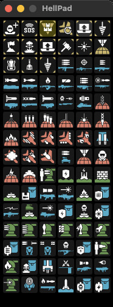
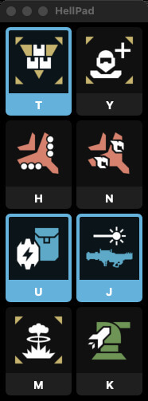
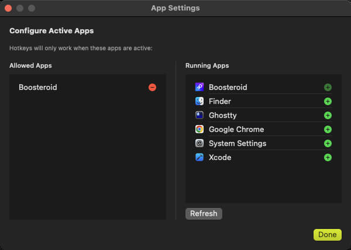

# HellPad

A native macOS application for executing HELLDIVERS™ 2 stratagems via customizable hotkeys. Perfect for cloud gaming services like Boosteroid where controller input isn't available.

## Screenshots

|                   Main Interface                   |                   Stratagem Picker                   |                   Combo Mode                   |
| :------------------------------------------------: | :--------------------------------------------------: | :--------------------------------------------: |
|  |  |  |

### App Settings



## Features

- **8 Customizable Stratagem Slots** - Assign any stratagem to any slot
- **Loadouts** - Save and load different stratagem configurations from the menu bar
- **Loadout Export/Import** - Share loadouts with friends via `.hellpad` files
- **Loadout Keyboard Shortcuts** - Hold modifier key (default: Option) + 1-9 to switch loadouts instantly
- **Right-Click to Clear** - Right-click any stratagem or keybind to clear it
- **Global Hotkeys** - Trigger stratagems from anywhere (T, Y, H, N, U, J, M, K)
- **Combo Mode** - Hold a configurable combo key and press multiple hotkeys to queue stratagems, release to execute sequentially
- **Smart Detection** - Only works when your configured apps are active (prevents accidental triggers)
- **Pause/Resume** - Ctrl+P to temporarily disable hotkeys
- **Rebindable Keys** - Change any hotkey to your preference
- **Configurable Game Controls** - Customize the stratagem menu key, directional keys (WASD or arrows), and activation mode
- **Hold or Toggle Mode** - Choose between holding the menu key or tapping once to open
- **Visual Feedback** - Yellow flash on activation, cyan glow for queued combos
- **Menu Bar App** - Stays out of your way with floating window option

## System Requirements

- **macOS 13.0 or later**
- **Xcode 15+** (for building from source)
- **Accessibility permissions** (required for global hotkeys)

## Installation

### Download Pre-Built App

1. Download the latest `HellPad-v1.0.9.zip` from [Releases](https://github.com/k33bs/HellPad/releases)
2. Unzip and move HellPad.app to your Applications folder
3. **Important:** Right-click HellPad.app → "Open" (first time only)
   - You'll see "unidentified developer" warning
   - Click "Open" to confirm
   - This is normal for unsigned apps
4. Grant Accessibility permissions when prompted

> **Note:** The app is unsigned to protect developer privacy. macOS will warn you on first launch - this is expected for open-source apps.

### Build from Source

1. Clone this repository:

   ```bash
   git clone https://github.com/k33bs/HellPad.git
   cd HellPad
   ```

2. Open `HellPad.xcodeproj` in Xcode

3. Select your development team in Signing & Capabilities

4. Build and run (Cmd+R)

## Usage

### Basic Hotkeys

Press any of the assigned keys (default: T, Y, H, N, U, J, M, K) to execute the corresponding stratagem in-game.

### Combo Mode

1. Hold the **Combo Queue Key** (default: Command, configurable in Controls tab)
2. Press keys to queue stratagems (icons glow cyan)
3. Release the combo key to execute sequence
4. Click mouse when each stratagem appears to throw it (3 second timeout)
5. Press **ComboKey+ESC** to cancel combo

### Pause/Resume

- **Ctrl+P** - Toggle HellPad on/off (gray overlay when paused)

### Customize Stratagems

- Click any stratagem icon to open the picker
- **Type-to-Search** - Type letters to filter stratagems
- **Keyboard Navigation** - Use arrow keys to navigate, Enter to select
- Press ESC to clear search or close picker
- Click outside to cancel

### Rebind Keys

- Click any keybind button (T, Y, etc.)
- Press a new key
- Duplicate keys will flash red on the conflicting slot
- Press ESC to cancel
- Auto-cancels after 6 seconds if no key pressed

### Clear Stratagems/Keybinds

- Right-click any stratagem icon to clear it from the slot
- Right-click any keybind button to reset it to empty
- Useful for freeing up keys without swapping

### Loadout Keyboard Shortcuts

- Hold the **Loadout Switch Key** (default: Option, configurable in Controls)
- Press a number key **1-9** to instantly switch to that loadout
- Loadouts are numbered in the menu bar dropdown for reference

### Configure Active Apps

1. Click menu bar icon
2. Select "Configure Apps..."
3. Add apps where hotkeys should work (e.g., HELLDIVERS™ 2, Chrome, Boosteroid)

### Configure Game Controls

1. Click menu bar icon → "Configure Apps..."
2. Select the **Controls** tab
3. Customize:
   - **Stratagem Menu Key** - The key that opens the stratagem menu in-game (default: Control)
   - **Combo Queue Key** - The key to hold for queuing multiple stratagems (default: Command)
   - **Loadout Switch Key** - The key to hold + 1-9 for quick loadout switching (default: Option)
   - **Activation Mode** - Hold (default) or Toggle
     - *Hold*: Hold the menu key while pressing directions
     - *Toggle*: Press menu key once, then press directions
   - **Directional Keys** - Map Up/Down/Left/Right to any keys (default: WASD, can use arrow keys)

## Permissions

HellPad requires **Accessibility** permissions to:

- Monitor global keyboard input
- Simulate keypresses for stratagem execution

Grant permissions in:
`System Settings > Privacy & Security > Accessibility`

## Technical Details

- **Built with:** Swift, SwiftUI, AppKit
- **Hotkey System:** CGEventTap for conditional key monitoring
- **Combo Execution:** Serial queue with semaphore-based mouse click detection
- **Thread-Safe:** Proper locking for all shared state
- **Logging:** OSLog for debugging (viewable in Console.app)

## Development

### Architecture

- `Services/` - Core logic (StratagemManager, EventTapManager, KeyPressSimulator)
- `Views/` - SwiftUI views (ContentView, StratagemPickerView, AppSettingsView)
- `Models/` - Data structures (Stratagem, Keybind, UserData)
- `Utils/` - Constants and helpers
- `Extensions/` - NSImage extensions for icon loading

### Building

1. Ensure **App Sandbox is disabled** in project settings
2. **Hardened Runtime** should be enabled
3. Code sign with your developer certificate

## Contributing

Contributions are welcome! Please feel free to submit pull requests or open issues for bugs and feature requests.

## License

This project is licensed under the GNU General Public License v3.0 - see the [LICENSE](LICENSE) file for details.

## Credits

**Inspired by:** [HellBuddy](https://github.com/chris-codes1/HellBuddy) by chris-codes1 - This is the original Windows application that inspired this port.

**Stratagem Data:** [Helldivers-2-Stratagem-JSON-Generator](https://github.com/k33bs/Helldivers-2-Stratagem-JSON-Generator) - Icons, sequences, and metadata

**SVG Source:** [Helldivers-2-Stratagems-icons-svg](https://github.com/nvigneux/Helldivers-2-Stratagems-icons-svg) by Nicolas Vigneux

Developed for the HELLDIVERS™ 2 community.

## Version History

### v1.0.9
- **Loadout Export/Import** - Share loadout configurations with friends
  - Export single loadout or all loadouts to `.hellpad` files
  - Import loadouts from files (duplicate names handled automatically)
  - Settings → Loadouts tab: Import/Export buttons

### v1.0.8
- **Default Combo Key Changed** - Now uses Command instead of Shift (avoids blocking sprint in-game)
- **UI Improvements** - Empty stratagem slots blend with background, keybind buttons fully clickable

### v1.0.7
- **Loadout Keyboard Shortcuts** - Switch loadouts with a key + number (1-9)
  - Hold the Loadout Switch Key (default: Option) and press 1-9
  - Instantly switches to the corresponding loadout
  - Loadouts numbered in menu bar for quick reference
  - Configurable in Settings → Controls tab
- **Right-Click to Clear** - Context menus for stratagems and keybinds
  - Right-click any stratagem icon to clear it
  - Right-click any keybind button to reset it to empty
  - Useful for freeing up keys without three-way swaps
- **Keybind Timeout** - Auto-cancels keybind listening after 6 seconds

### v1.0.6
- **Hover Preview** - Magnified icon preview when hovering in the picker
  - Toggle on/off in Settings
  - Crisp Retina rendering with debounced appearance
- **Type-to-Search** - Filter stratagems in the picker by typing
  - Type letters/numbers to search (case-insensitive)
  - White border appears on first match (indicates keyboard navigation available)
  - Backspace to delete characters
  - ESC to clear search or close picker
- **Keyboard Navigation** - Navigate filtered results with keyboard
  - Arrow keys to move selection between icons
  - Enter to select highlighted stratagem
  - Down arrow jumps to last icon when no icon directly below

### v1.0.5
- **Python Commandos Warbond** - Added 3 new stratagems:
  - M-1000 Maxigun
  - AX/FLAM-75 Guard Dog Hot Dog
  - CQC-9 Defoliation Tool
- **Category Sorting** - Stratagem picker now groups icons by category matching in-game order:
  - Common → Objectives → Offensive → Supply → Defense
- Updated all 93 stratagem icons (zopflipng optimized)

### v1.0.4
- **Loadouts** - Save and load different stratagem/keybind configurations
  - Save current setup via "Save Loadout..." in menu bar
  - Switch loadouts instantly from the menu bar dropdown
  - Manage loadouts in Settings → Loadouts tab
  - Checkmark indicates active loadout (clears when you modify settings)
  - Duplicate names prevented, unique default names generated

### v1.0.3
- **Configurable Combo Queue Key** - Rebind the key used to queue multiple stratagems (default: Command)
- **Fixed modifier key handling** - Super keys like Control now work correctly in HELLDIVERS
- **Improved combo execution** - Click buffering fixed to prevent accidental throws
- Removed Done button from settings (closes via window controls)

### v1.0.2
- **Configurable Game Controls** - New Controls tab in settings
  - Customize the stratagem menu key (default: Control)
  - Choose between Hold or Toggle activation modes
  - Rebindable directional keys (WASD, arrow keys, or any keys)
- Settings window now has tabbed interface (Apps / Controls)

### v1.0.1
- Initial public release
- 8 customizable stratagem slots with global hotkeys
- Combo mode for queueing multiple stratagems
- Smart app detection
- Pause/Resume with Ctrl+P
- Rebindable slot hotkeys
- Visual feedback (flash, combo glow)
- Menu bar app with floating window

---

**Not affiliated with or endorsed by Arrowhead Game Studios or Sony Interactive Entertainment.**
